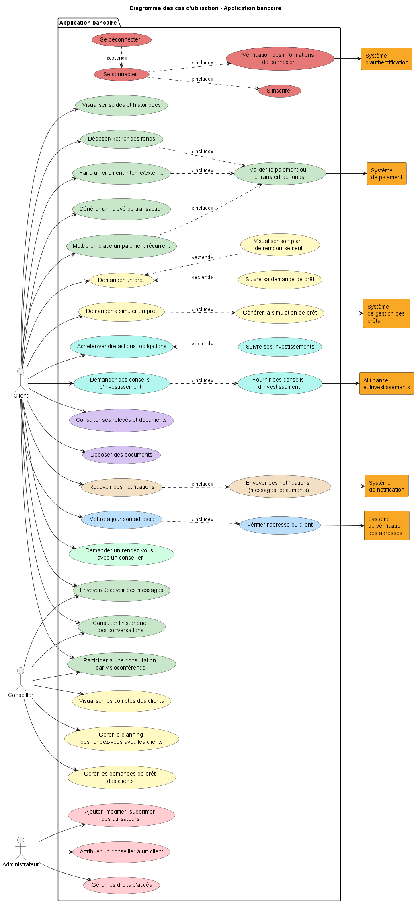
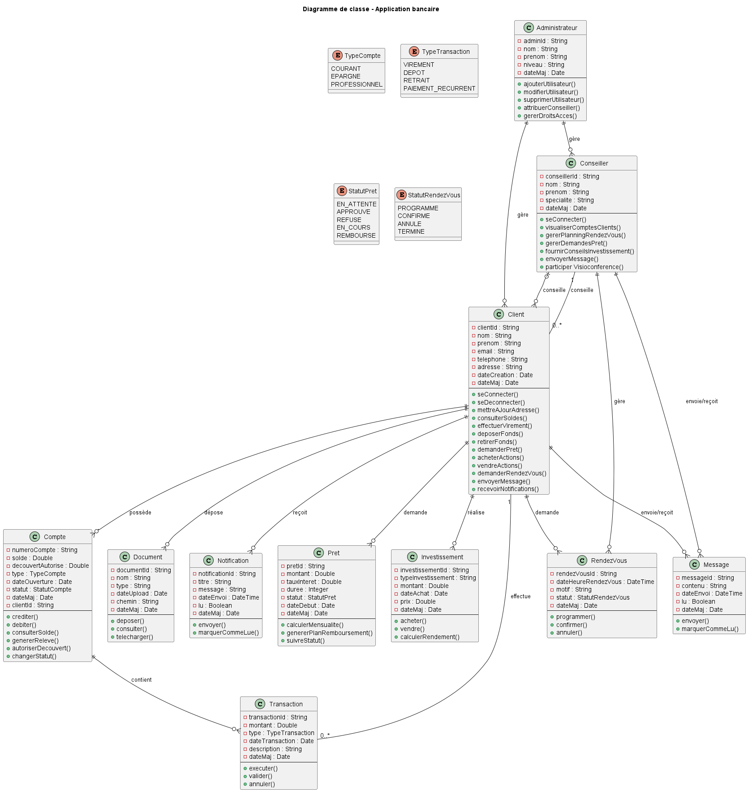
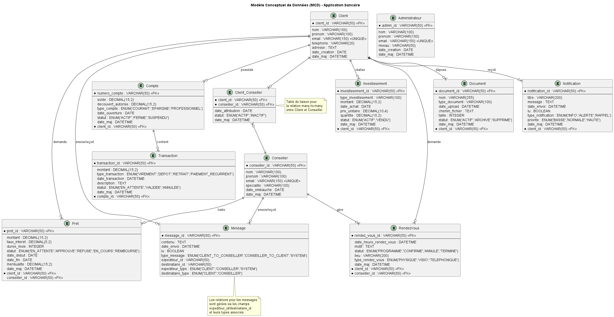
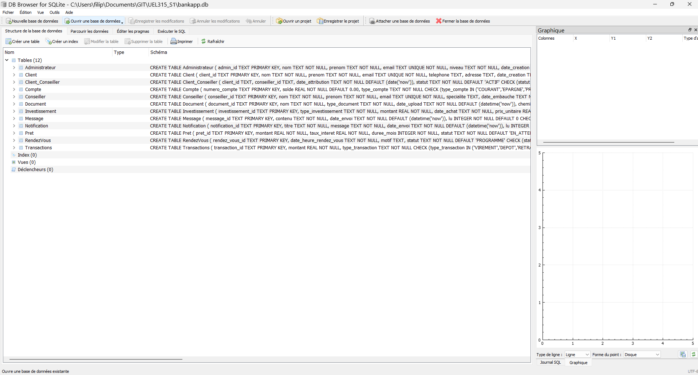
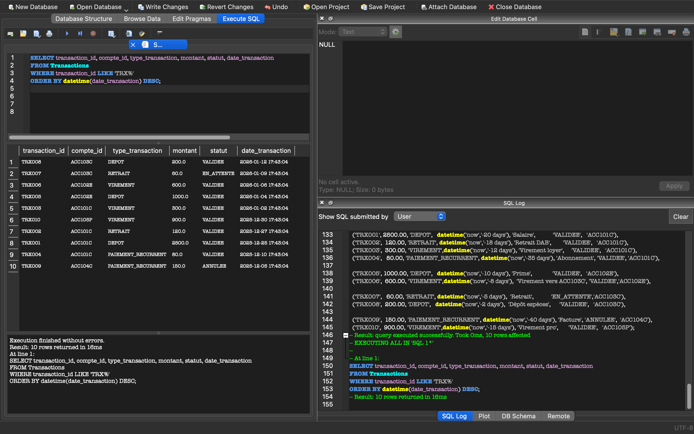
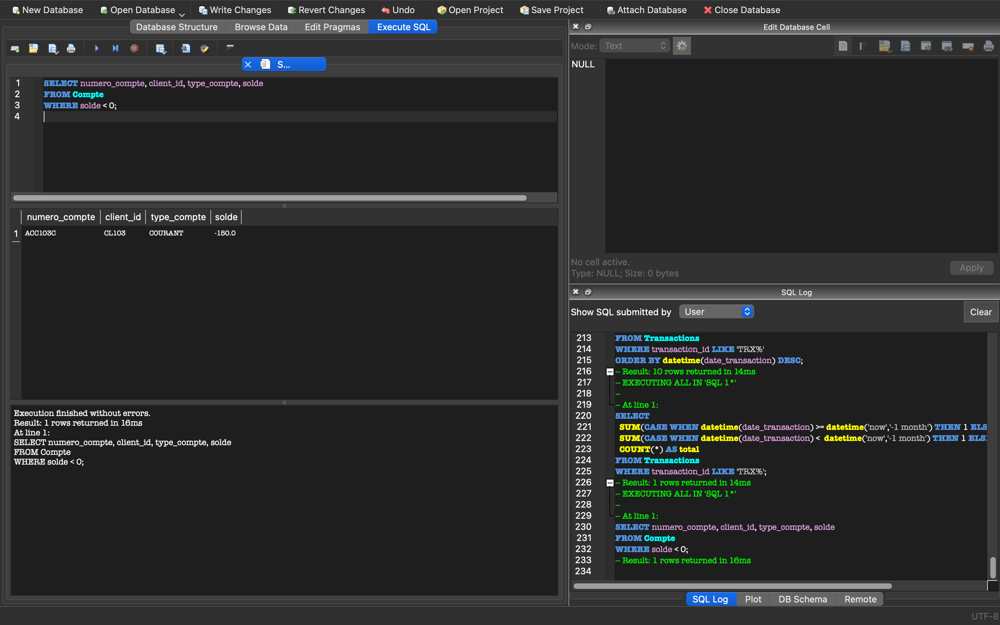
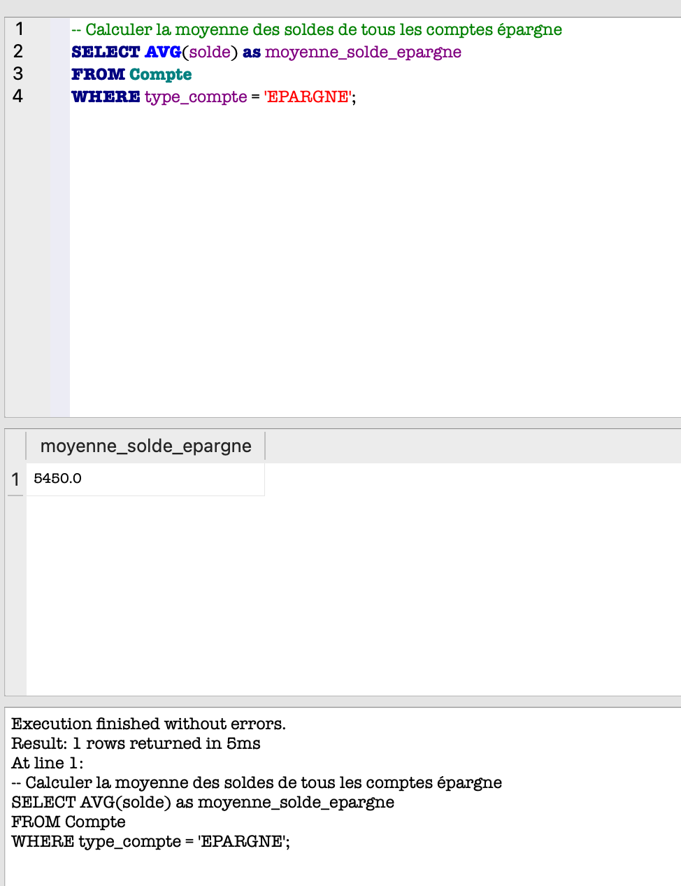
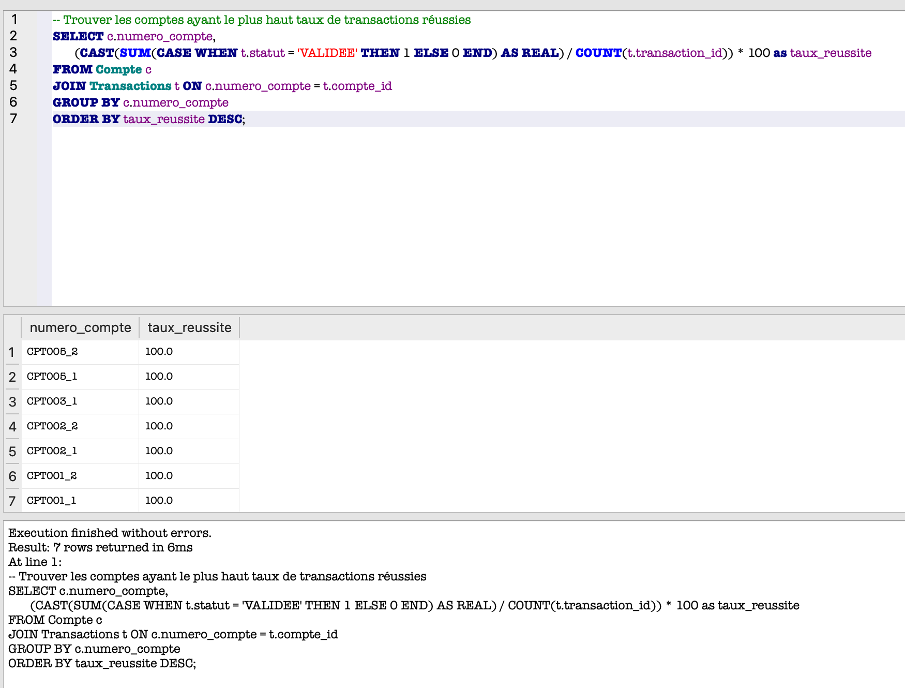
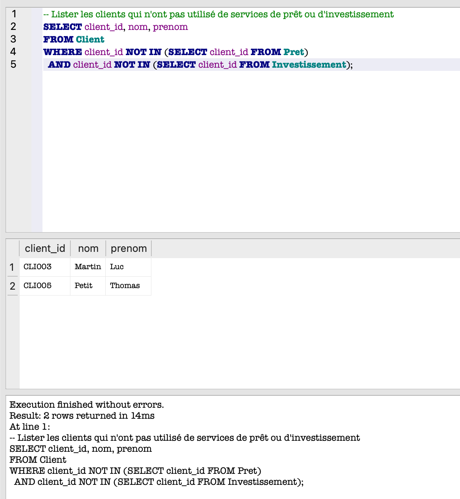
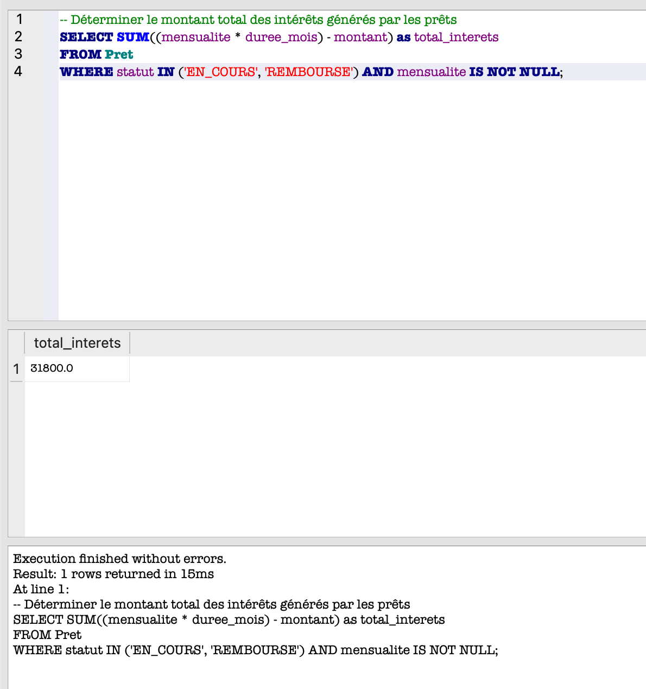

# UEL315 Base de données (Groupe D)

## Membres du groupe

| Etudiant.e  |   Alias    |
| :---------: | :--------: |
| Mathilde C. | Clouddy23  |
|   Kamo G.   | Spaghette5 |
| Mathieu L.  |  mathleys  |
| Filippos K. |  filkat34  |

## Objectifs

- [x] Concevoir un diagramme de cas d'utilisation
- [x] Concevoir un diagramme de classes
- [x] Concevoir un modèle conceptuel de données
- [x] Créer la base de données SQLite
- [x] Créer les tables de la base de données SQLite
- [x] Rédiger un script sql avec les requêtes à la base de données
- [x] Exécuter le script SQL pour créer et peupler la base de données
- [x] Tester les requêtes de SELECT, UPDATE, DELETE

## Préparation de l'environnement de travail

- Lire la documentation sur le [site officiel](https://plantuml.com/fr/guide) concernant les diagrammes de cas d'utilisation et de classes.
- Installer l'extension [PlantUML](https://marketplace.visualstudio.com/items?itemName=jebbs.plantuml) sur VSCode.
- Regarder [un tutoriel](https://www.youtube.com/watch?v=xkwJ9GwgZJU) pour prendre en main l'extension VSCode de PlantUML
- Télécharger et installer [DBBrowser](https://sqlitebrowser.org/) pour pouvoir gérer une base de données SQLite
- Se renseigner sur les spécificités de [SQLite](https://sqlite.org/lang.html)

## Processus à suivre

1. Créer une branche du dépôt et travailler sur ses requêtes dans le fichier `bankapp_script.sql`
2. Tester ses requêtes en les insérant à la base (fichier `baknapp.db`) grâce à DB Browser
3. Prendre des captures d'écran de ce que vous faites sur DB Browser et les déposer dans le dossier `docs` du dépôt
4. Faire sa demande de tirage

## Tâches

### Modelisation de la base des données

- [x] Concevoir un diagramme de cas d'utilisation
- [x] Concevoir un diagramme de classes
- [x] Concevoir un modèle conceptuel de données

### Création de la base de données

- [x] Création d'une base de données SQLite `bankapp.db` grâce au logiciel _DB Browser_
- [x] Ecriture des requêtes SQL de création des différentes tables à partir du MCD
- [x] Exécution du script de création des tables sur DB Browser

## Requêtes SQL du TD

### 1. Insérer des Données

- [x] Ajouter 5 nouveaux clients dans la table Clients.

- [x] Créer 3 nouveaux comptes pour chaque client ajouté.

- [x] Insérer 10 transactions pour différents comptes.

### 2. Lire des Données

- [x] Sélectionner les clients ayant un solde supérieur à 10 000 €.

- [x] Afficher toutes les transactions effectuées le mois dernier.

- [x] Lister tous les comptes avec un découvert autorisé.

### 3. Mettre à Jour des Données

- [x] Mettre à jour le numéro de téléphone d'un client spécifique.
- [x] Augmenter le découvert autorisé pour certains comptes.
- [x] Modifier le statut des transactions en attente.

### 4. Supprimer des Données

- [x] Supprimer les comptes inactifs depuis plus de 2 ans.
- [x] Effacer les transactions refusées ou annulées.
- [x] Retirer les clients sans transactions actives.

### 5. Requêtes Complexes

- [x] Compter le nombre total de transactions par type de compte.

- [x] Calculer la moyenne des soldes de tous les comptes épargne.

- [x] Trouver les 5 clients les plus actifs en termes de transactions.

- [x] Lister les prêts dont la durée restante est inférieure à un an.

- [x] Afficher le total des prêts accordés par conseiller.

### 6. Requêtes Avancées

- [x] Identifier les clients avec un total d'investissements supérieur à leur solde total.

- [x] Trouver les comptes ayant le plus haut taux de transactions réussies.

- [x] Lister les clients qui n'ont pas utilisé de services de prêt ou d'investissement.

- [x] Déterminer le montant total des intérêts générés par les prêts.

- [x] Calculer la variation mensuelle du nombre de transactions.

## Webographie

### Autres logiciels de modelisation opensource

- [Looping](https://www.looping-mcd.fr/)
- [Umbrello](https://apps.kde.org/fr/umbrello/)

### Pour s'entraîner au SQL

- [SQLBolt](https://sqlbolt.com/)
